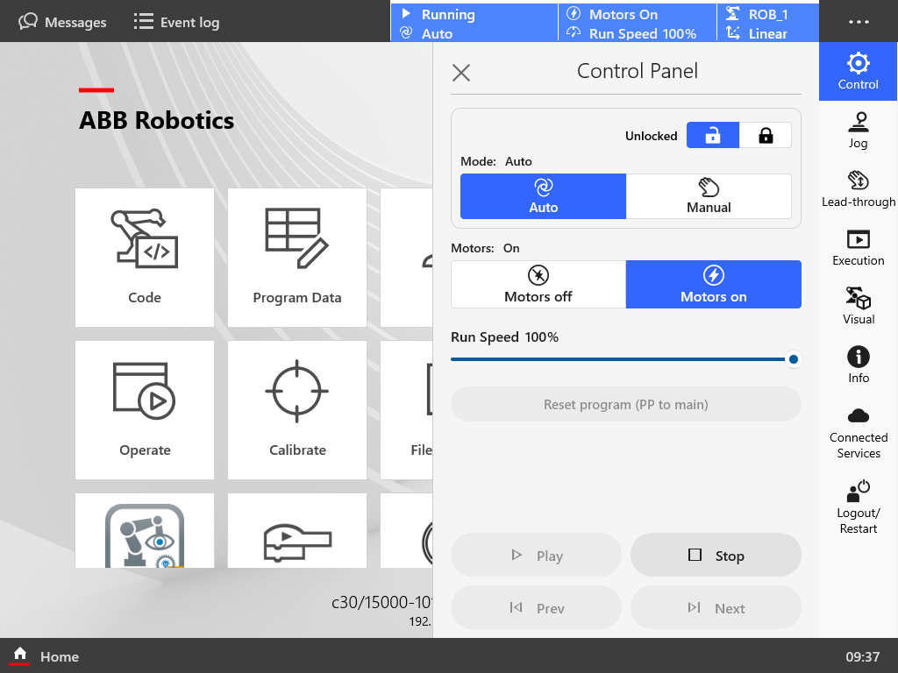
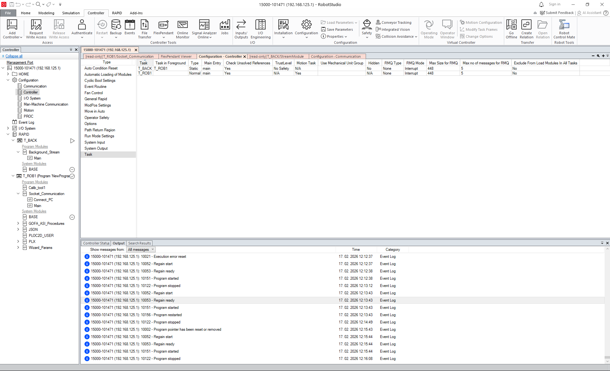

# ABBGoFa_Py2RAPID

# Lab Guide: Remote Control and Telemetry of ABB GoFa

## 0. RobotStudio and Controller Setup

Before executing any code, ensure the hardware and software environments are synchronized. This setup allows your PC to communicate with the ABB OmniCore controller over the standard Service Port.

### Software Connection
* **Launch RobotStudio**: Open RobotStudio 2025 and ensure your PC is physically connected to the robot controller via the Service Port (IP: `192.168.125.1`).
* **Authentication**: Connect to the controller using the following credentials:
    * **Username**: `admin`
    * **Password**: `robotics`

### Operating Mode Configuration
To allow the Python scripts to take control of the motion, the robot must be placed in the correct operating state using the FlexPendant's **Control Panel**.




1.  **Unlock the Controller**: Ensure the lock icon is set to "Unlocked" to allow changes to the mode.
2.  **Switch to Auto Mode**: Select **Auto** mode. In this mode, the robot can execute the RAPID program continuously without the user holding a three-position enabling device.
3.  **Enable Motors**: Tap **Motors on**. You should hear a distinct "click" from the controller as the brakes are released and power is supplied to the joints.
4.  **Set Run Speed**: Ensure the **Run Speed** is set to **100%**. While the RAPID code uses internal speed instructions (e.g., `v100`), the controller-level override must be at 100% for these to execute at their programmed velocity.
5.  **Reset Program Pointer**: Tap **Reset program (PP to main)**. This is a critical step that ensures both the Motion Task (`T_ROB1`) and Background Task (`T_BACK`) start execution from the very beginning of their respective `Main` procedures.

---

### Verification
Once configured, the status bar at the top of the FlexPendant should display:
* **Status**: `Running` (after pressing Play)
* **Mode**: `Auto`
* **Motors**: `On`
* **Speed**: `100%`
  
  
## 1. Simple example (example 1)

**Understanding the Command Logic (T_ROB1)**: 
The motion task handles the **"Heavy Lifting"**—receiving text commands, performing safety validation, and controlling the physical movement of the arm.

### A. RAPID Logic Flow (`Socket_Communication.mod`)
Code is in file `ex1_RAPID_code`.

1.  **Server Setup:**
    The `Connect_PC` procedure initializes the communication stack and opens a "Listener" on **Port 5000**. The robot execution will pause at the `SocketAccept` instruction until the Python script is launched on the PC.

2.  **String Parsing:**
    The robot receives raw data as a string (e.g., `"[50,0,10]"`). The built-in RAPID function `StrToVal` is used to deserialize this text into a `pos` data type, which stores the numeric X, Y, and Z components.

3.  **Safety Validation:**
    Before any motor command is issued, the code performs a bounds check. It verifies if the `Abs` (absolute value) of the requested X, Y, and Z offsets are within the defined `max_x`, `max_y`, and `max_z` constants.
    * **If unsafe:** The move is bypassed, and an `ERROR` message is returned to the client.

4.  **Motion Execution:**
    The robot uses the `Offs(pHome, ...)` function to calculate a new target destination relative to the established **pHome** coordinate. The `MoveL` command then moves the TCP (Tool Center Point) in a precise straight line at a constant speed of **100 mm/s**.

5.  **Feedback:**
    Once the robot reaches the `fine` stop point, it queries its own internal state using `CJointT()` (current joints) and `CRobT()` (current robtarget). This data is concatenated into a single string, separated by a pipe character `|`, and transmitted back to Python to confirm the move is complete.


### B. Python Logic Flow (`ex1_simple.py`)

The Python script acts as the **Network Master**, following a synchronous **Request-Response** pattern. This ensures that the PC never sends a second command until the robot has finished the first one.

1.  **Connection Initialization:**
    The script creates a standard TCP/IP socket using the `AF_INET` (IPv4) and `SOCK_STREAM` (TCP) protocols. It connects to the robot's Service Port IP (`192.168.125.1`) on **Port 5000**.

2.  **The Input Loop:**
    * **User Input:** The script pauses and waits for the student to type a coordinate.
    * **Data Encoding:** Python strings are Unicode, but network sockets require raw bytes. The script uses `.encode()` to convert the text before sending.
    * **Special Commands:** If the user types `'q'`, the script sends `"EXIT"` to the robot. This triggers a graceful shutdown on the ABB side, closing the ports correctly.

3.  **Synchronous Waiting (`s.recv`):**
    After sending a command, Python execution stops at the `s.recv(1024)` line. It will "block" (wait) here until the robot finishes its physical movement and sends back the confirmation string. This is a safety feature that prevents command "stacking."

4.  **Data Processing:**
    The script receives a combined data string. It uses the `.split('|')` method to break the message into two parts:
    * **Part 1 (Cartesian):** Real-world X, Y, Z coordinates.
    * **Part 2 (Joints):** Angular values for axes 1 through 6.

5.  **Clean Shutdown:**
    The `finally:` block ensures that even if the script crashes, the network socket on the PC is closed, preventing "Port already in use" errors during the next run.

## 2. Advanced example (example 3)

### 1. System Overview
This laboratory setup utilizes a **Multi-Tasking architecture** on the ABB OmniCore controller. This allows the robot to maintain a stable control loop for motion while simultaneously streaming high-frequency telemetry data to an external PC.

#### Controller Configuration: Adding Parallel Tasks
To enable simultaneous motion and data streaming in a project that only contains a motion task, you must manually configure a second task in RobotStudio.



1.  **Navigate to Configuration**: Under the **Controller** tab in RobotStudio, go to **Configuration** > **Controller** > **Task**.
2.  **Create T_BACK**: Right-click and select **New Task**. Configure it with the following parameters:
    * **Task Name**: `T_BACK`.
    * **Type**: **Static** (This ensures the task runs independently of the motion state).
    * **Motion Task**: **No**.
3.  **Verify T_ROB1**: Ensure `T_ROB1` is set as a **Normal** task type with **Motion Task** set to **Yes**.
4.  **Load Modules**: In the **RAPID** tab, right-click the new `T_BACK` folder to load `ex3_RAPID_code_T_BACK`, and ensure `ex3_RAPID_code_T_ROB1` is loaded into `T_ROB1`.
5.  **Warm Start**: Restart the controller to apply these configuration changes.

#### Core Components:

* **T_ROB1 (Motion Task):** 
    * Saved in file `ex3_RAPID_code_T_ROB1`.
    * **Role:** Acts as the **Command Server**.
    * **Network:** Listens on **Port 5000**.
    * **Function:** It remains in a waiting state until it receives a JSON-style string `[x, y, z]`. Upon receipt, it calculates an offset from the predefined `pHome` position and executes a linear move (`MoveL`).
  
* **T_BACK (Background Task):** 
  * Saved in file `ex3_RAPID_code_T_BACK`.
  * **Role:** Acts as the **Telemetry Server**.
  * **Network:** Listens on **Port 5001**.
  * **Function:** This is a "Static" background task that runs independently of the motion pointer. It broadcasts the robot's current Cartesian coordinates and Joint angles every **100ms** (10Hz).

* **Python Client:**
  * **Architecture:** Utilizes two distinct scripts running in parallel. 
  * **Advantage:** This prevents the "Blocking" nature of Python's `input()` function from pausing the incoming data stream, ensuring the live feed remains constant regardless of user input speed.

---

### 2. Technical Specifications
| Feature | Command Port (5000) | Telemetry Port (5001) |
| :--- | :--- | :--- |
| **Protocol** | TCP/IP | TCP/IP |
| **Data Format** | String: `[x, y, z]` | String: `X,Y,Z|J1,J2,J3,J4,J5,J6` |
| **Logic** | Request / Response | Continuous Stream |
| **Safety** | Software Bounds Applied | Read-Only |

---

### 3. Communication Flow
1. **Connection:** The Python client establishes two separate sockets to the Robot IP.
2. **Command:** User enters coordinates in the Command Console.
3. **Execution:** `T_ROB1` validates the bounds and moves the arm.
4. **Feedback:** `T_BACK` continuously updates the Telemetry Dashboard with real-time encoder data.
5. **Logging:** All incoming telemetry is timestamped and saved to `robot_telemetry_log.csv` for post-lab analysis.

### 4. Startup Procedure (Order is Important)

To ensure synchronization between the ABB controller and the Python clients, and to avoid **"Connection Refused"** or **"Limit Errors" (40195)**, follow these steps exactly:

#### Phase 1: Robot Side (Server Initialization)
1. **Load Modules:** Ensure the RAPID modules are loaded into their respective tasks: `Background_Stream` into **T_BACK** and `Socket_Communication` into **T_ROB1**.
2. **Task Verification:** Open the **Tasks** window on the FlexPendant. Ensure both **T_ROB1** and **T_BACK** are checked/enabled in the task list.
3. **Reset Program Pointer:** Tap **"PP to Main"** for all tasks. This clears any previous error states and starts the execution from the first line of code.
4. **Execute:** Press the physical **Play** button on the FlexPendant. 
   * *Observation:* Check the message log on the pendant; it should indicate that the robot is now listening for incoming connections.


#### Phase 2: PC Side (Client Connection)
1. **Terminal 1 (Telemetry):** Execute the listener script:
    ```bash
    python ex3_stream_viewer2.py
    ```

   * `ex3_stream_viewer2.py`:
       * **Function:** Establishes the telemetry connection to **Port 5001**.
       * **Output:** Initializes the live dashboard for real-time monitoring and creates the `robot_telemetry_log.csv` file for data persistence.

2. **Terminal 2 (Control):** Execute the commander script:
    ```bash
    python ex3_testsocket2.py
    ```

   * `ex3_testsocket2.py`:
       * **Function:** Establishes the command connection to **Port 5000**.
       * **Output:** Opens the interactive command console, allowing the user to send `[x, y, z]` movement vectors to the GoFa.

> #### ⚠️ Critical Operational Note
> **Connection Reset Logic:** If you stop the Python scripts, the robot's sockets may remain in a "half-open" state. To ensure the sockets are properly released and re-bound:
> 1. Stop the Robot program via the FlexPendant.
> 2. Reset the **Program Pointer (PP to Main)** for both tasks.
> 3. Restart the Robot program **before** restarting the Python clients.

### 5. Safety Constraints

To ensure a safe learning environment and prevent equipment damage, the robot controller is programmed with **Software-Defined Safety Limits**. These boundaries are enforced at the RAPID code level before any motion is executed.

#### Operational Workspace Limits
The following offsets are relative to the designated `pHome` position:

| Coordinate | Constraint | Allowable Range |
| :--- | :--- | :--- |
| **X-Axis** | Max Offset | $\pm 100\text{ mm}$ |
| **Y-Axis** | Max Offset | $\pm 100\text{ mm}$ |
| **Z-Axis** | Max Offset | $\pm 50\text{ mm}$ |


#### Boundary Enforcement
If a command is sent that exceeds any of these parameters:
1. The **T_ROB1** task will intercept the command before the `MoveL` instruction.
2. The robot will remain stationary.
3. An `ERROR: Out of bounds` message will be sent back to the Python **Terminal 2**.
4. The system will reset and wait for a new, valid coordinate.

> **Safety Reminder:** These software limits are secondary to the physical **Emergency Stop** and the robot's built-in **Collision Detection**. Students should always keep one hand near the E-Stop during active motion.

### 6. Troubleshooting

If you encounter issues during the lab, refer to the following table to diagnose and resolve common errors.

| Error / Symptom | Probable Cause | Solution |
| :--- | :--- | :--- |
| **Timeout Error** | Robot server not responding or unreachable. | 1. Check if the FlexPendant **Play** button is active (Green).<br>2. Verify the PC is connected to the Service Port and the IP `192.168.125.1` is correct. |
| **CSV File is Empty** | Telemetry stream never connected or is offline. | Confirm `ex3_stream_viewer2.py` is connected to Port 5001; this script flushes each row immediately. |
| **40195: Limit Error** | Too many connection attempts/retries. | The background task has exceeded its retry limit. On the FlexPendant, select all tasks and tap **"PP to Main"**, then press **Play**. |
| **41574: Socket Error** | Socket used before creation. | This occurs if the program pointer was moved manually. Perform a **"PP to Main"** reset to re-initialize the socket handlers. |
| **Log: "Connection Refused"** | Robot task is not in a listening state. | Ensure the yellow Program Pointer in **T_BACK** is sitting on the `SocketAccept` line. If not, reset and play. |


### 7. Understanding the Telemetry Logic (T_BACK)

While the motion task waits for commands, the **Background Task** (`T_BACK`) operates as an independent telemetry server. Its sole purpose is to broadcast the robot's physical state to the PC without interrupting motion.

#### A. High-Frequency Streaming Loop
The `Background_Stream` module is designed for **persistence** and **reliability**. It ensures that even if the network cable is unplugged and plugged back in, the stream will recover automatically.

##### 1. Connection Management (Lifecycle)
* **Cleanup & Setup:** Every time the program starts (or restarts after an error), it explicitly closes any existing sockets and re-binds to **Port 5001**.
* **Passive Listening:** The task uses `SocketListen` and `SocketAccept`. It sits in a "waiting" state until your Python `stream_viewer2.py` script initiates the connection.

##### 2. The Data Pipeline
Once a connection is active, the robot performs the following steps every **0.1 seconds (10Hz)**:

* **State Capture:** It captures the current Tool Center Point (TCP) position using `CRobT()` and the individual axis angles using `CJointT()`.
* **Data Formatting:** To keep the network packet small and fast, the data is converted to strings and rounded to two decimal places.
    * **Format:** `X,Y,Z | J1,J2,J3,J4,J5,J6`
    * *Example:* `500.25,0.00,620.10|-0.12,15.44,-10.02,0.00,45.00,0.00`
* **Transmission:** The `SocketSend` instruction pushes this string to the PC.


#### B. Robustness & Error Recovery
Industrial environments are prone to network noise. This code includes several "failsafes":

1.  **Safety Check (`SocketGetStatus`):** Before every send, the robot checks if the client is still there. If the Python script is closed, the robot detects `SOCKET_CONNECTED` is false and uses a `GOTO StartOver` to reset the server gracefully.
    
2.  **The Error Handler:** If a hard network error occurs (e.g., `ERR_SOCK_CLOSED`), the `ERROR` block catches it. Instead of the task stopping (Red light), it closes all ports, waits 1 second, and uses `RETRY` to jump back to the start and wait for a new connection.

---

> **Note :** Because `T_BACK` is a background task, it has no control over the robot's motors. It is a "Read-Only" observer. This separation of concerns is a standard safety practice in industrial robotics.

### 8. Analyzing the Motion Logic (`Socket_Communication.mod`)

The Motion Task (**T_ROB1**) is the "Engine" of the project. It handles precise mechanical movement and ensures that commands from Python do not exceed the physical or safety limits of the GoFa.

#### A. Code Breakdown

##### 1. Variable & Constant Declarations
* **`pHome`**: A `robtarget` defining the "Zero" or reference point for all relative movements. In this lab, it is set to `[500, 0, 620]`.
* **Safety Constants (`max_x`, `max_y`, `max_z`)**: These hard-coded limits act as a "Virtual Cage." The robot will check every incoming command against these values before moving.

##### 2. The Main Command Loop
The `WHILE TRUE` loop ensures the robot is always ready for the next command.

* **`SocketReceive`**: The robot "listens" for a string. If the Python script isn't sending anything, the robot simply waits here (blocking execution).
* **`StrToVal`**: This is a critical step. It attempts to parse the text `"[x,y,z]"` into a numeric `pos` variable. If the student enters text like `"hello"`, the `ok` flag becomes `FALSE`, and the robot sends back an "Invalid Format" error.
* **`MoveL Offs(...)`**: Instead of moving to an absolute coordinate, the robot moves to an **offset** from `pHome`. This is safer for beginners as it keeps the robot within a known, predictable workspace.
    * *Example:* If Python sends `[10, 0, 0]`, the robot moves to `[510, 0, 620]`.


##### 3. Feedback Generation
After the motion is complete (`fine` stop point), the robot captures its new state.
* **Rounding:** The code uses `Round(... \Dec:=2)` to clean up the data. Without this, the robot might send values like `500.000000021`, which creates unnecessary noise in the CSV logs.
* **The Separator (`|`)**: This character is used as a delimiter, allowing the Python script to easily split the Cartesian data from the Joint data using the `.split()` method.

---

#### B. Safety Features in the Code

| Feature | RAPID Implementation | Purpose |
| :--- | :--- | :--- |
| **Bound Checking** | `IF Abs(target_pos.x) > max_x` | Prevents the robot from over-extending or hitting the table. |
| **Graceful Exit** | `IF received_data = "EXIT"` | Allows the user to shut down the lab without triggering "Connection Lost" errors. |
| **Error Handling** | `ERROR` block with `SocketClose` | Ensures that if the network fails, the ports are wiped clean so the next student can connect without a reboot. |

---

> #### 💡 Tip
> If the live telemetry stops updating but the robot is still moving, check the **Terminal 1** window. If you see a "Socket Closed" message, it means the background task encountered an error. Simply restart the Python script; the RAPID code is designed to automatically reset the server and wait for you.

---

### Note on Example 2 Code
The `ex2_` code shown in this repository are partial snippets for demonstration and may omit setup/cleanup or error-handling details.
